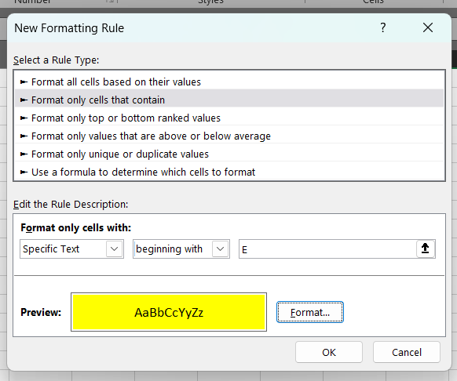
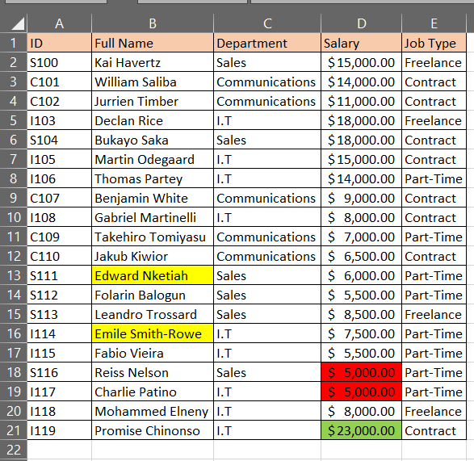
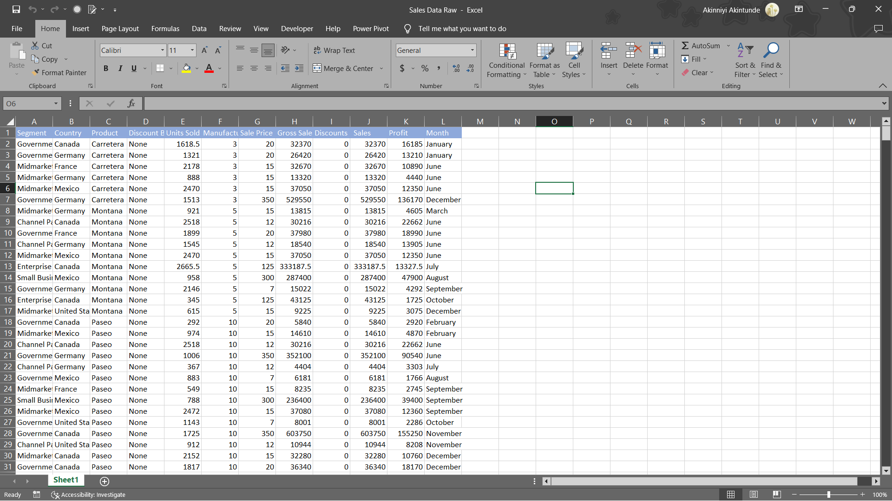

# Introduction to Excel for Data Analysis

## Task 1🧰

#### Sub Task 1
---
In worksheet 1, create a table with 20 rows of information having the fields below: 
- Employee ID
- Employee Full Name
- Department (Communications, Sales, I.T)
- Salary (between $5000 to $25000)
- Job type (Part-time, Freelance, Contract)
  
Copy and paste the table into Worksheet 2 and Worksheet 3

#### My Input🚀
---
I created the table as instructed with all five(5) columns and twenty(20) rows. I will love to point out that in the Employee ID column which I simply named ID, I used an alphabet before three(3) numbers. the alphabet is meant to identify staff by their department as follows:
- S for Sales
- C for Communications
- I for I.T

  

#### Sub Task 2
---
In worksheet 1, Show only employees who are ‘Freelancers’ and highlight the ones whose salaries are above $10000

#### My Input🚀
---
Under the **Data** ribbon, I selected the **Filter** command which gave me the option to filter my table as I like. I filtered the **Job Type** column and selected only **_Freelance_**. I then returned to the **Home** ribbon where I used the **Conditional Formatting** command. I used the **Highlight Cell Rules**, then chose **Greater Than** command where I was given a window where I inputted _$10000_, and the employees whose salaries are greater than $10000 were highlighted as seen below.

#### Sub Task 3
---
In worksheet 2, split the employees’ full names into first name and last name. Check for duplicates and highlight if any (do not delete)

#### My Input🚀
---
With the _Full Name_ column highlighted, I selected the **Text to Column** command under the **Data** ribbon. I chose my delimeter as _Space_ and selected my destination column and the _Full Name_ was split into two columns which I names _First Name_ and _Last Name_.
With the _First Name_ and _Last Name_ columns highlighted, I used the **Conditional Formatting** command. I used the **Highlight Cell Rules**, then chose **Duplicate Values**. Because my data does not have duplicate values, nothing was highlighted.

#### Sub Task 4
---
In worksheet 3, highlight employees whose names begin with the letter ‘E’ (in yellow). Format the Salary column such that the highest SALARY has a green background and the lowest SALARY has a red background.

#### My Input🚀
---
With the _Full Name_ column highlighted, I used the **Conditional Formatting** command and selected **Highlight Cell Rules**, then chose **More Rules** command and formatted it as instructed.

I then highlighted the _Salary_ column and used the **Conditional Formatting** command and selected **Top/Bottom Rules** and chose **Top 10 items** and adjusted it to show the _top 1_ item. I repeated the process but chose the **Bottom 10 items** and adjusted it to show the _Bottom 1_ item.

---
## Tasks 2 and 3🧰

Using the same Sales Data, determine the following:
- The total Revenue and Profit generated
- The average Revenue and Units Sold for every order
- The total Discount given in $
- Total number of sales recorded
- The highest Profit generated
- Create a column named ‘Sales Range’, and return ‘High Sales’ if the Sales value is above average, otherwise, return ‘Low Sales’.
- The average revenue generated from each sale of ‘Paseo’
- The number of sales made in the Government and Midmarket segment
- The total revenue generated from the sales of ‘Montana’ in Canada
- In which Country, Segment and Month was the highest unit of goods sold?
- What is the total profit made in December?

---
## My Input🚀

Here is a sneak peek into the dataset for tasks 2 and 3

- Total Revenue is the total amount of Sales made and we can get that with the following formula `=SUM(J2:J701)`
---
- Total profit generated is the sum total of profit made and we can get that with the following formula `=SUM(K2:K701)`
---
- Average Revenue: `=AVERAGE(J2:J701)`
---
- Average Unit Sold: `=AVERAGE(E2:E701)`
---
- The total discount given in $ is calculated by getting a sum total of discounts as in _column I_. The formula to achieve that is `=SUM(I2:I701)`
---  
- Total number of sales recorded: `=SUM(E2:E701)`
---
- The highest profit generated is gotten by using this formula `=MAX(K2:K701)` which combs through the entire profit column and returns the highest value.
---
- For the generated _Sales Range_ column, this formula `=IF(J2>AVERAGE($J$2:$J$701), "High Sales", "Low Sales")` references the _Sales_ column and compares each cell in it with the average value from the whole column and returns either _High Sales_ or _Low Sales_ depending on if the value in the cell is lower or higher than the average.
---
- For the average revenue generated from each sale of 'Paseo', we will use the `AVERAGEIF` function and the formula is like this `=AVERAGEIF(C2:C701, "Paseo", J2:J701)` and what this means is that we are asking excel to comb through the _Product_ column and filter out the only 'Paseo' before cross-referencing the output with the equivalent values in the _Sales_ column and getting the Average.
- In simple terms, **IF** the value in the _Sales_ column is for 'Paseo', find the average.
---
- For the number of Sales made in the 'Government' and 'Midmarket' segments, we use the following formula `=SUMIF(A2:A701, "Government", E2:E701) + SUMIF(A2:A701, "Midmarket", E2:E701)`. What we ask excel to do here is to add the units sold for the government segment and the units sold for the Midmarket segment together.
- Simply put, **IF** the sale is for 'Government', add it up and if the sale is for 'Midmarket', add it up and put the 2 sales sums together.
---
- For the total revenue for the sales of 'Montana' in 'Canada', we use the following formula: `=SUMIFS(J2:J701, B2:B701, "Canada", C2:C701, "Montana")`.
- What this formula does is to filter Sales by Product and choosing only sales for the product 'Montana' then further filtering the result by Country and choose only 'Canada' then sum up what is left.
---
- To get the Country, Segment and Month where the highest unit of goods was sold, we first need to get the value of the highest unit sold, and to do that, we use the following formula `=MAX(E2:E701)`. The formula simply combs through the _Units Sold_ column and returns the highest value.
- With this answer, we use **VLOOKUP** to source for the Country, Segment and Month when the highest value emanated from.

Parameter  | Formula
-----------|-------------------------------------
Country    | `=VLOOKUP(Q13, E2:O701, 11, FALSE)`
Segment    | `=VLOOKUP(Q13, E2:O701, 10, FALSE)`
Month      | `=VLOOKUP(Q13, E2:L701, 8, FALSE)` 

_Disclaimer: Because `VLOOKUP` can only look forward, we had to copy the **Segment** and **Country** columns to the end of the table for the formulas to work._

---
- Total profit made in December:🎅 `=SUMIF(L2:L701, "December", K2:K701)`. What this formula does is to comb through the Profit column and add only the profits that were for the month of December🎅.
---
Here are the answers to the tasks

---
## Conclusion🤓
Through these tasks, I have been able to test and prove my knowledge of:
- Data manipulation and management
- Basic Excel functions and formulas
- Conditional functions
- Advanced functions
